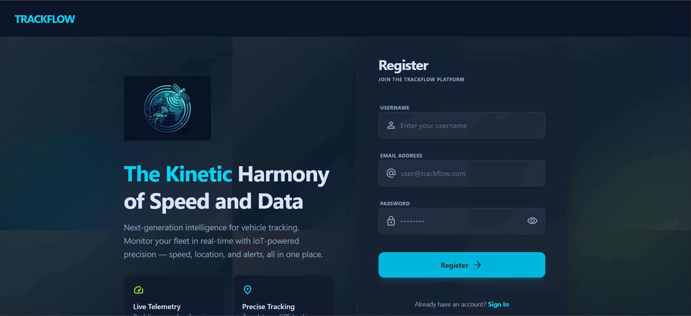
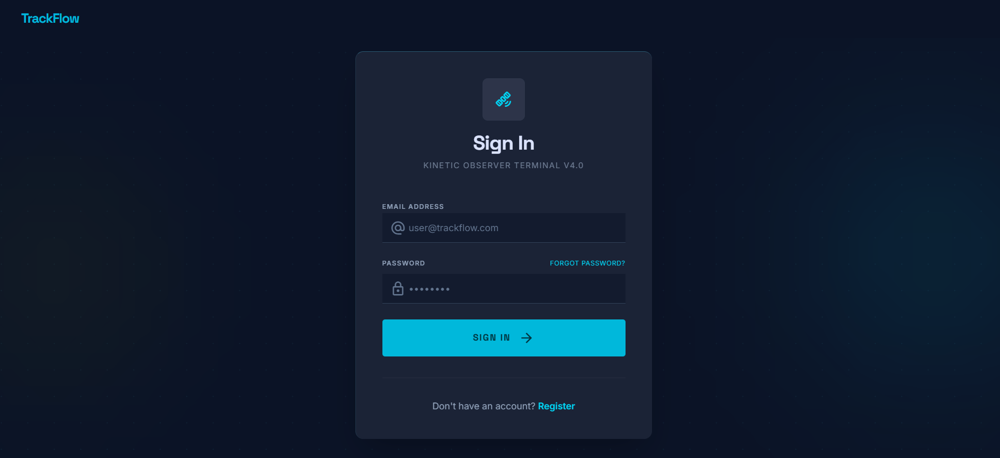
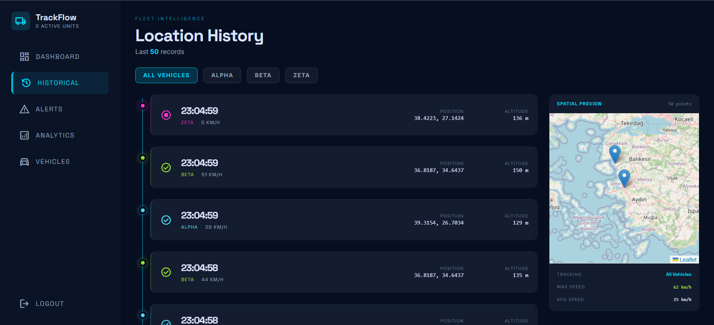
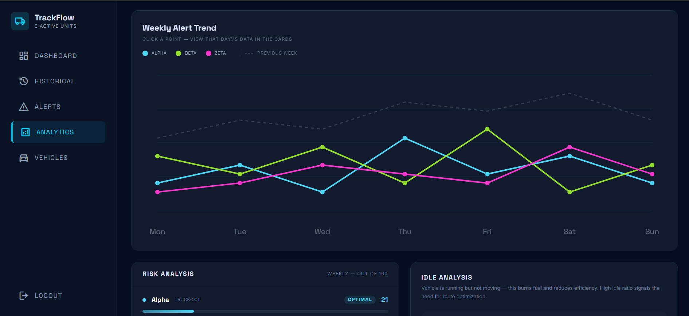
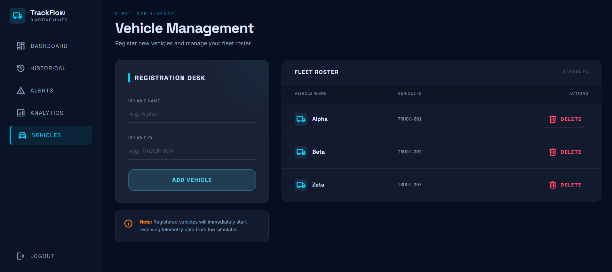

# TrackFlow — IoT Vehicle Tracking Platform

A full-stack IoT vehicle tracking system that processes simulated GPS data over an MQTT broker and streams it in real time to a React frontend via WebSocket. Built with a focus on real-time data pipelines, alert systems, and fleet management.

> **Note:** Vehicle location data is generated by a built-in GPS simulator (3 vehicles, configurable). The system architecture mirrors a production IoT setup — replacing the simulator with real hardware requires only swapping the data source.

---

## 📸 Screenshots













---

## ✨ Features

- 🗺️ **Real-time Dashboard** — Live GPS tracking with Leaflet map, speed gauge, altitude and heading telemetry via WebSocket
- 🚨 **Smart Alert System** — Detects speed violations, offline events, and idle states with cooldown mechanisms to prevent alert spam
- 📋 **Alert Management** — Filterable, paginated alert list with severity analytics and type distribution
- 🤖 **AI Fleet Analysis** — Groq API (Llama 3.1) powered fleet insights, persisted in localStorage between sessions
- 📍 **Location History** — Timeline view of historical GPS records with per-vehicle Leaflet map and route polylines
- 📊 **Analytics** — Risk scoring per vehicle using MongoDB aggregation, with speed violation and offline counts
- 🚗 **Vehicle Management** — Add and delete vehicles per user account
- 🔐 **JWT Authentication** — Secure register/login with protected routes and Axios interceptor for token refresh handling
- 📡 **MQTT Broker** — Aedes broker receiving GPS data from simulator, fanning out to Redis and MongoDB
- ⚡ **Redis Caching** — Latest vehicle position stored in Redis for instant retrieval
- 🕒 **MongoDB History** — Full location history persisted for analytics and replay

---

## 🛠️ Tech Stack

| Layer | Technology |
|-------|-----------|
| Frontend | React, TypeScript, Tailwind CSS, Leaflet |
| Backend | Node.js, Express.js, TypeScript |
| Database | MongoDB, Mongoose |
| Cache | Redis, ioredis |
| Messaging | MQTT (Aedes broker), mqtt.js |
| Real-time | WebSocket (ws) |
| Auth | JWT, bcrypt |
| AI | Groq SDK (openai/gpt-oss-20b) |
---

## 🏗️ Architecture

```
GPS Simulator (fake GPS data)
        ↓
MQTT Broker (Aedes — ws://localhost:8888)
        ↓
   ┌────┴────┐
   ↓         ↓
Redis      MongoDB
(last pos) (history)
        ↓
  WebSocket Server
        ↓
  React Frontend
```

---

## 📂 Project Structure

```
vehicle-tracking-iot/
├── backend/
│   └── src/
│       ├── middleware/
│       │   └── authMiddleware.ts       # JWT verification
│       ├── models/
│       │   ├── Alerts.ts               # Alert schema
│       │   ├── LocationHistory.ts      # GPS history schema
│       │   ├── User.ts                 # User schema
│       │   └── Vehicle.ts              # Vehicle schema
│       ├── routes/
│       │   ├── alerts.ts               # Alert CRUD + pagination
│       │   ├── analytics.ts            # Risk score aggregation
│       │   ├── auth.ts                 # Register & login
│       │   ├── history.ts              # Location history
│       │   └── vehicles.ts             # Vehicle add/delete
│       ├── services/
│       │   └── groqService.ts          # Groq AI integration
│       ├── broker.ts                   # Aedes MQTT broker
│       ├── db.ts                       # MongoDB connection
│       ├── redis.ts                    # Redis connection
│       ├── server.ts                   # Express app
│       ├── simulator.ts                # GPS data simulator
│       └── websocket.ts                # WebSocket server
│
└── frontend/
    └── src/
        ├── api/
        │   ├── analytics.ts            # Analytics + AI summary
        │   ├── auth.ts                 # Register & login
        │   ├── history.ts              # Location history
        │   └── vehicles.ts             # Vehicle CRUD
        ├── components/
        │   ├── Sidebar.tsx             # Navigation sidebar
        │   └── ProtectedRoute.tsx      # Auth guard
        ├── hooks/
        │   └── useVehicles.ts          # Fetch vehicles + color assignment
        ├── pages/
        │   ├── Dashboard.tsx           # Real-time telemetry + map
        │   ├── AlertsPage.tsx          # Alert list + AI analysis
        │   ├── AnalyticsPage.tsx       # Risk analytics
        │   ├── HistoryPage.tsx         # Location history timeline
        │   ├── VehicleManagement.tsx   # Add/delete vehicles
        │   ├── LoginPage.tsx
        │   └── RegisterPage.tsx
        └── types/
            ├── alert.ts
            ├── analytics.ts
            ├── gps.ts
            └── vehicles.ts
```

---

## ⚙️ Getting Started

### Prerequisites

- Node.js v18+
- MongoDB (local or Atlas)
- Redis (running locally on default port 6379)
- Groq API Key → [console.groq.com](https://console.groq.com)

### Backend

Create a `.env` file inside `backend/`:
```env
PORT=5000
MONGODB_URI=your_mongodb_connection_string
JWT_SECRET_KEY=your_jwt_secret
GROQ_API_KEY=your_groq_api_key
```
```bash
cd backend
npm install
npm run dev
```

In a separate terminal, start the simulator:
```bash
npx tsx src/simulator.ts
```

### Frontend

Create a `.env` file inside `frontend/`:
```env
VITE_API_URL=http://localhost:5000
```
```bash
cd frontend
npm install
npm run dev
```

## 🔐 API Endpoints

### Auth

| Method | Endpoint | Description |
|--------|----------|-------------|
| POST | `/api/auth/register` | Register a new user |
| POST | `/api/auth/login` | Login and receive JWT token |

### Vehicles (Protected)

| Method | Endpoint | Description |
|--------|----------|-------------|
| GET | `/api/vehicles` | List user's vehicles |
| POST | `/api/vehicles/add` | Add a new vehicle |
| DELETE | `/api/vehicles/:vehicleId` | Delete a vehicle |

### Alerts (Protected)

| Method | Endpoint | Description |
|--------|----------|-------------|
| GET | `/api/alerts` | Get alerts with filter + pagination |

### Analytics (Protected)

| Method | Endpoint | Description |
|--------|----------|-------------|
| GET | `/api/analytics` | Get risk scores per vehicle |
| POST | `/api/analytics/ai-summary` | Get AI-generated fleet insights |

### History (Protected)

| Method | Endpoint | Description |
|--------|----------|-------------|
| GET | `/api/history` | Get location history (optional `?vehicleId=`) |

---

## 🔒 Technical Highlights

- **MQTT Pipeline** — Simulator publishes to `vehicle/:id/location`, broker subscribes and fans out to Redis (last position) and MongoDB (history)
- **Smart Alerts** — Alert system checks each incoming GPS packet for speed > threshold, offline detection, and idle state — with per-vehicle cooldown timers to prevent duplicate alerts
- **Risk Scoring** — MongoDB aggregation calculates risk score per vehicle based on speed violations and offline counts
- **AI Analysis** — Groq API receives fleet summary and returns structured JSON cards with severity levels, persisted to localStorage
- **JWT Interceptor** — Axios interceptor on frontend handles 401 responses and clears token automatically
- **Dynamic Vehicle Colors** — `useVehicles` hook fetches vehicles from DB and assigns colors by index — no hardcoded vehicle data on frontend

---

## 🌱 What I Learned

- Building a real-time IoT data pipeline with MQTT, Redis, and WebSocket
- Designing a multi-user backend with JWT authentication and user-scoped data
- MongoDB aggregation for analytics and risk scoring
- Integrating AI APIs (Groq) for fleet insights
- Managing real-time state in React with WebSocket connections
- Custom React hooks for shared data fetching logic